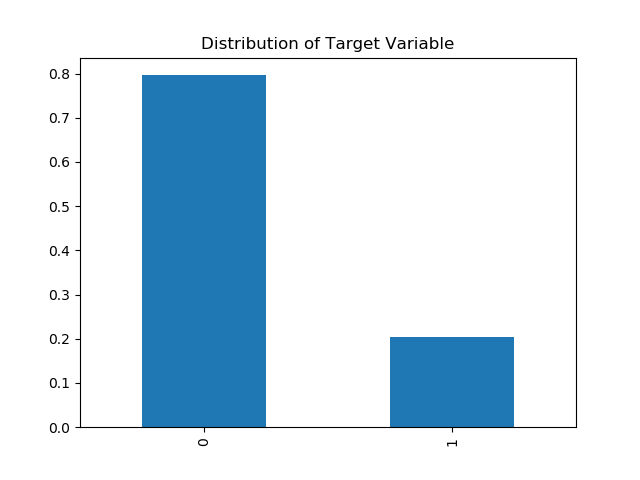
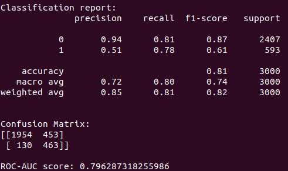
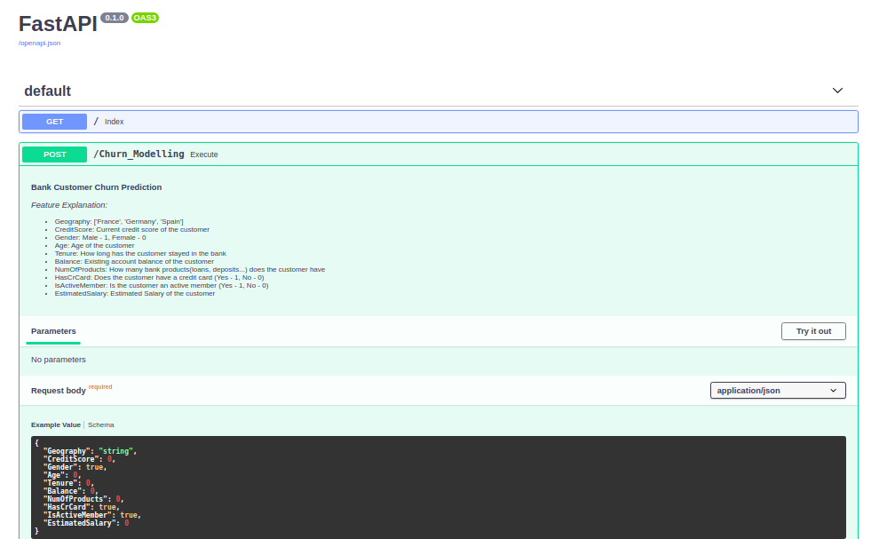
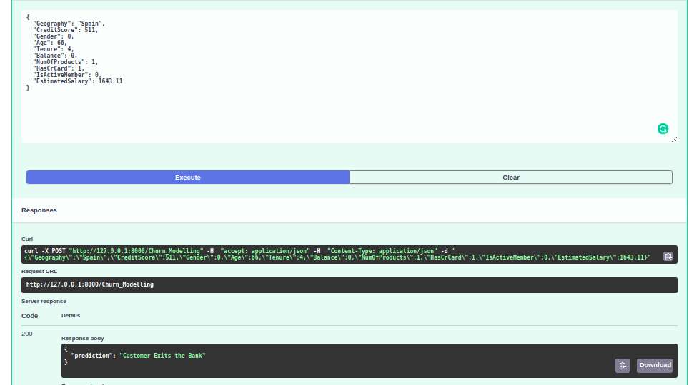
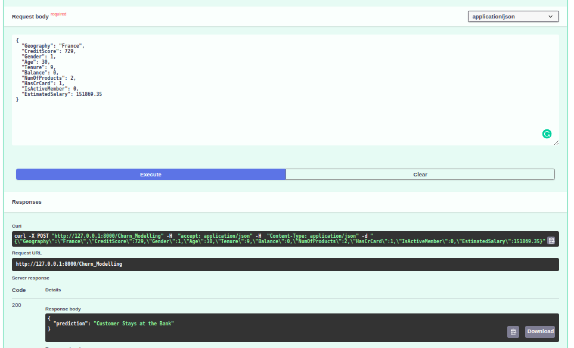

# Building an API for Bank Customer Churn Prediction using ANN and FastAPI

This repository consist of codes to build 
- a Neural Network to predict whether an existing customer leaves or stays at the bank
- a WebAPI for the above model using FastAPI  

### Dataset:
The dataset is taken from Kaggle and contains details of a bank's customers (around 10000 rows) with a binary target reflecting whether the customer leaves the bank (closes account) or continues to be a customer.  
  
As seen from the above plot, Target is unbalanced. This issue is taken care while training the neural network by assigning class weights.

### Files:
| filename | Description |
|----------|-------------|
| requirements.txt | Basic libraries and packages required for execution |
| Churn_Modelling.csv | Dataset |
| ann.py | Artificial Neural Network Model for Prediction |
| ann_model.h5, scaler_std.pkl | Backend model(serialized) |
| app.py, base_model.py | scripts for building API |

### Steps to Execute:
1. Git clone the repository. 
2. Make sure you have all the libraries and packages as mentioned in the requirements.txt. If not run ```pip install -r requirements.txt```
3. Run ```uvicorn app:application --reload```
4. Open the browser and go to URL : http://127.0.0.1:8000/docs
5. Fill in the feature values in the body to get the predictions.

### Layout and Results:
Artificial Neural Network (ANN) has an accuracy of 81%.  
  
  
Eventhough the dataset is imbalanced, recall proves equal percentages for both the cases.  
    
###### FastAPI Layout:  

  
Considering 2 cases from the dataset, ANN model provides the right prediction!
###### Case 1:   
  
  
###### Case 2:  
  
  
### References:
[1] [Churn Modelling](https://www.kdnuggets.com/2017/03/datascience-customer-churn-modeling.html)  
[2] [FastAPI Documentation](https://fastapi.tiangolo.com/)  

