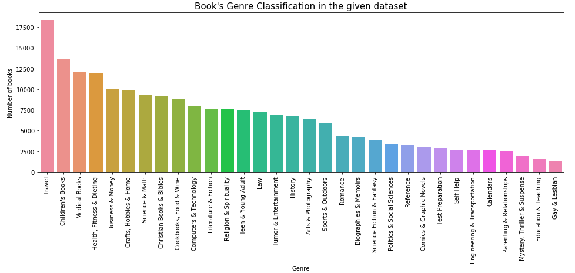

# WebApp for predicting a Book's Genre from its Title

This repository consists of files required to create and deploy a machine learning model as a WebApp using Flask for predicting the Genre from the Book's Title.

### Dataset:
Data for this experiment is taken from [here](https://github.com/uchidalab/book-dataset). The dataset consists of 207,572 books categorized into a total of 32 Genre's. A simple logistic regression is employed for book's genre prediction.
  
Here's how the books are classified in this dataset:

  
### Files:
| filename | Description |
|----------|-------------|
| requirements.txt | Basic libraries and packages required for execution |
| book_list.csv | Dataset |
| Book Genre Prediction.ipynb | Notebook (step by step explanation) |
| model_deployment.py, app.py | Python scripts for model creation and deployment |
| genrePrediction.pkl | Backend model(serialized) for Webapp |
| static/\*, templates/\* | Front-end (html/css styling) for Webapp |

### Steps to Execute:
1. Git clone the repository. Make sure you have all the libraries and packages as mentioned in the requirements.txt
2. Run ```python3 app.py```
3. Open the browser and go to URL : http://127.0.0.1:5000/
4. Type in a 'Book's Title' to get your result

### TestApp:
Machine Learning model has an accuracy of 63%  
  


