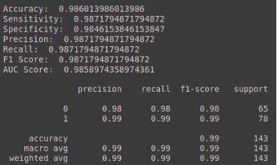

# Detecting Covid-19 through Transfer Learning

This repo is an implementation of a research paper titled [COVID-19 Detection Through Transfer Learning Using Multimodal Imaging Data](https://ieeexplore.ieee.org/abstract/document/9167243) (M. J. Horry et al.) The research demonstrates how Covid-19 can be detected using transfer learning from deep learning models for three most commonly used medical imaging modes X-Ray, Ultrasound, and CT scan. The main research motivation is to provide over-stressed medical professionals a second pair of eyes through intelligent deep learning image classification models.

Only the best model (VGG19) is implemented using transfer learning for 3 out of 5 experiments [table 5 of research paper; experiments 1A, 2A and 3A].

### Data Source
1. Chest X-ray:  
[covid-chestxray-dataset](https://github.com/ieee8023/covid-chestxray-dataset)  
[chest-xray-pneumonia](https://www.kaggle.com/paultimothymooney/chest-xray-pneumonia)  
2. Chest CT:  
[COVIDNet-CT](https://github.com/haydengunraj/COVIDNet-CT)  
3. Ultrasound:  
[covid19_ultrasound](https://github.com/jannisborn/covid19_ultrasound)  
4. Preprocessed images (CLAHE):  
[N-clahe-medical-images](https://github.com/mhorry/N-CLAHE-MEDICAL-IMAGES)  

### Implementation
- Preprocessing images using CLAHE  
- Resizing images to classifier default size (224,224,3)  
- Apply data augmentation (horizontal flip, rotation, horizontal and vertical shift)  
- Train/Test Split [80 : 20]  
- Classifier model (VGG19) with ImageNet weights  
- Evaluation and Predictions  

### Results
With VGG19(base model) - Flatten - FC(16-64, relu) - Dropout(0.1-0.2) - Output(2, softmax)  

##### Chest X-ray Covid Vs Normal Images  
   

  

  
##### Chest CT Covid Vs Non-Covid Images  
     

  

  
##### Ultrasound Images Covid Vs Normal Images  
     

  

  
### Testing
Executing [test_file](src/test.py), results in accurate predictions  
   

### Conclusion
This project focused on implementing a deep learning model (vgg19) using transfer learning for Covid-19 detection in multimodal medical images as described in the research paper. All experiment results are validated against the paper findings.
