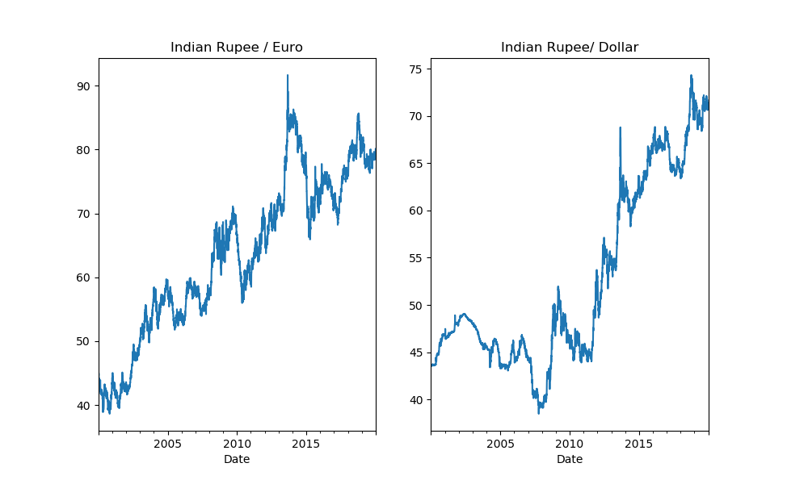
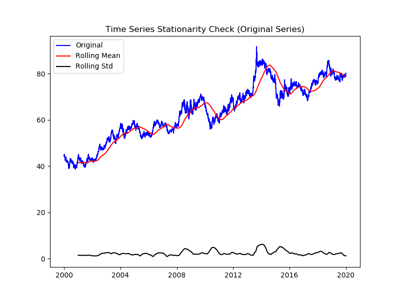
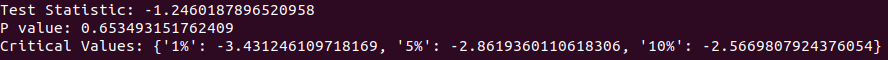
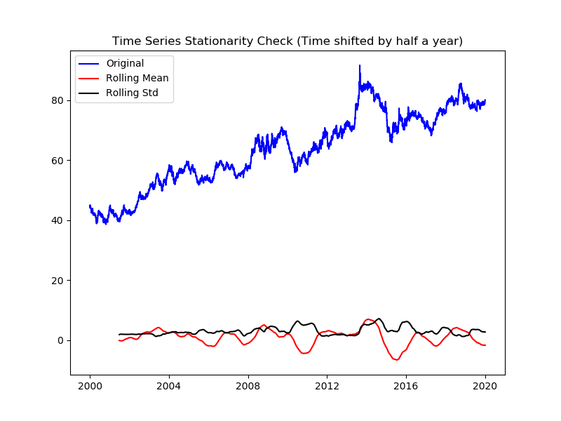
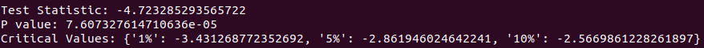
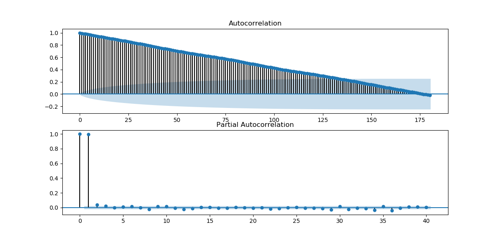
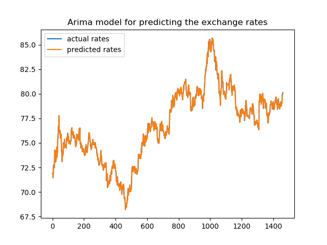
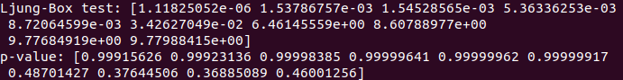
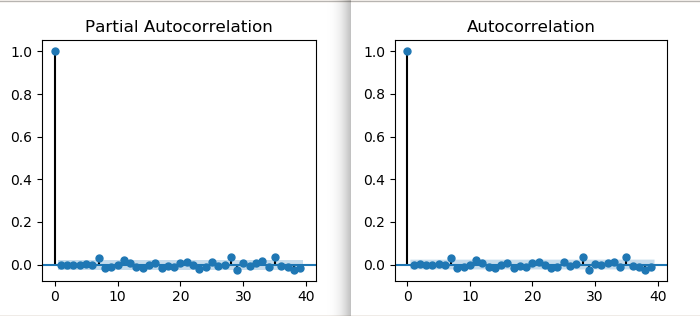
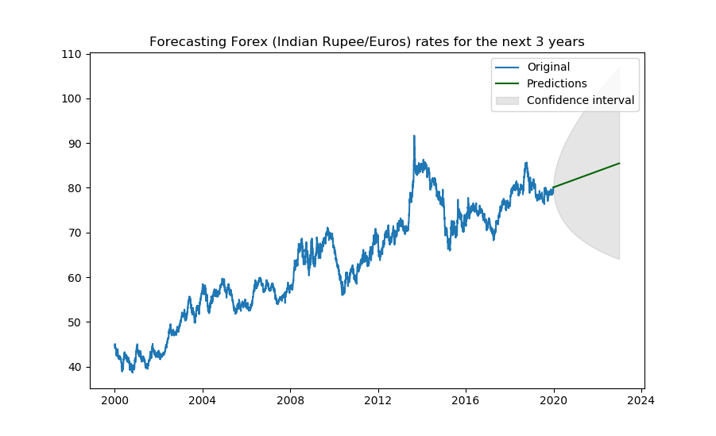

# Forecasting Foreign Exchange Rate by using ARIMA Model: A Case of Ind Rupee/Euro Exchange Rate

### Abstract
Auto-Regressive Integrated Moving Average (ARIMA) has been one of the widely used linear models in time series forecasting during the past decades. This project focuses on using ARIMA, a linear statistical model for forecasting the exchange rate and in particular for the case of Indian Rupee - Euro.

### Introduction
One of the most important and widely used time series models is the ARIMA model. ARIMA is used to capture autocorrelation in the series by modeling it directly. ARIMA model is nothing but a composition of three models namely Auto-Regression(AR), Integration(I), and Moving Average(MA).  
  
- The auto-regression part of the ARIMA model is used to do a regression on the current data point based on the previous data points (lag points) mentioned. p is conventionally used to denote the number of lag points needed to do the regression.  
  
- The moving average models account for the possibility of a relationship between a variable and the residuals from previous periods, represented by q. However, the series must be stationary to perform the above step.  
  
- A series is said to be stationary, if there’s no trend or seasonality, variance stays constant and autocorrelations remain steady throughout the entire series. Any non-stationary series could be converted to stationary by removing the trend and/or seasonality by a differencing operator. d is conventionally used to represent the order of differencing.  
  
Adding all the three steps leads to the ARIMA model. ARIMA model selection typically follows the Box-Jenkins Methodology:  
- Identification   
- Estimation    
- Diagnostic checking   
  
### Implementation  
#### Data and Preprocessing  
File: [Foreign_Exchange_Rates](Foreign_Exchange_Rates.xlsx)  
Source: Open Exchange Rates API  
Records: 5217 rows and 23 columns. Columns correspond to country's currency rates measured wrt 'US Dollar'.   
Missing entries: 7303 records are missing in the dataset, which correspond to 'date' column.   
Handling missing values: Backward Fill followed by Forward Fill method.   
  
Here is a plot showing variation of Ind-Rupee/Euro and Ind-Rupee/Dollar over the years.  
  
  
#### Identification of p,q,d
q and p can be found by using the autocorrelation function (ACF) and partial autocorrelation function (PACF) plots, while d is given by the order of differencing.
  
##### Test for Stationarity:
Augmented Dicky Fuller Test is used to check if the time series is stationary or not.  

  
  
  
As seen from the result, p-value > test statistic. Series is not Stationary and has an increasing trend for the mean. Converting the series to stationary by differencing.  
  

  
Time series is now weakly stationary (p-value < test statistic) after a half year shift.

##### ACF and PACF to find the Autoregressive and Moving Averages values 
Identification of an Autoregressive (AR) model is often best done with the PACF. For an AR model, the theoretical PACF “shuts off” past the order of the model. The phrase “shuts off” means that in theory the partial autocorrelations are equal to 0 beyond that point.  
  
Identification of an Moving averages (MA) model is often best done with the ACF rather than the PACF. For an MA model, the theoretical PACF does not shut off, but instead tapers toward 0 in some manner.  

  
From the plots pacf and acf, p = 5 and q = 1. 
  
#### Estimation: Using Arima to predict the exchange rates
With p = 5, d = 1, q= 1, fitting arima for each data point in the time series will give the below plot.   
  
  
Mean Squared Error: 0.096  

#### Diagnostic checking using Ljung-Box test
The final part of modelling a time series is to study the residuals. Ideally, the residuals will be white noise, with no autocorrelation. A good way to test this is to use the Ljung-Box test.   
  
  
The null hypothesis for the Ljung-Box test is that there is no autocorrelation. Here the p-values are > 0.05, hence we accept NULL hypothesis i.e., residuals are not correlated.   
  
Since plots resemble that of a white noise, model is good enough to use for forecasting.  

#### Forecasting for next 3 years

#### Conclusion:
With a mean square error of 0.096, ARIMA clearly performs very well in forecasting the exchange rates for a smaller period of time. However ARIMA is essentially backward looking in a long-run, as forex series often involves turning points and/or undeterministic trends.
